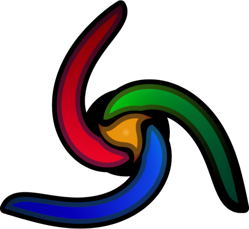

	
	<h1 align="center">Trinity</h1>
	
A retro 2.5D game engine

	

		<a href="https://github.com/trinity-engine/trinity">Source code [WIP]</a>
		.
		<a href="https://github.com/trinity-engine/trinity-demos">Demos [WIP]</a>
		.
		<a href="./history.md">History [WIP]</a>
	

	
	
	
	
	  

	
Table of contents

	<ul>
		<li><a href="#introduction">Introduction</a></li>
		<li><a href="#last-unpublished-version">Last Unpublished Version</a></li>
	</ul>

## Introduction
> [!NOTE]
> Trinity is a work-in-progress and is currently not public.

**Trinity** is a retro 2.5D software-rendered game engine written in [C99](https://en.wikipedia.org/wiki/C99)
using the [SDL2](https://wiki.libsdl.org/SDL2/FrontPage) library and [Lua](https://www.lua.org/about.html)
for scripting. It is inspired by game engines like [Valve's Source engine](https://en.wikipedia.org/wiki/Source_(game_engine)),
the [Doom engine](https://en.wikipedia.org/wiki/Doom_engine), the [Build engine](https://en.wikipedia.org/wiki/Build_(game_engine))
the [Quake engine](https://en.wikipedia.org/wiki/Quake_engine) and [Roblox](https://en.wikipedia.org/wiki/Roblox).

Trinity aims to support the following platforms:
- Windows
- Linux
- MacOS

## Last Unpublished Version

The first scrapped version of Trinity was an advanced [raycaster](https://lodev.org/cgtutor/raycasting.html).
It had a sky with proper 3D perspective, procedurally animated water with an illusion of "3D" waves,
angled walls, and support for varying floor and ceiling heights, similar to Doom.

To achieve this, I came up with a simple "sector" technique that divides each screen column into
segments based on tile floor and ceiling heights. Essentially, it groups together multiple tiles of
the same floor/ceiling height into a "sector" and renders it. If a sector's floor is higher than the
previous one, a wall is drawn to close the gap. Similarly, if the sector's ceiling is lower than
the previous one, a wall is again rendered to close the gap.

For angled walls, I used basic line intersection checks between the ray line and the tile's internal
geometry to determine the correct wall offset for the column.

The water animation was inspired by Quake's wobbly portal texture animation. I observed its behavior
and attempted to recreate it using a simple sine/cosine combination for both axes. To achieve the
"3D" water waves illusion, a sine-wave cutout is generated along the edge of water sectors and water
is rendered inside that shape.

While this engine was perhaps impressive as an advanced raycaster, it was too limited for general
game development. That's why I decided to remake Trinity as a Build-style engine - arguably the most
flexible type of 2.5D software-rendered engine.

> [!NOTE]
> See the [Trinity history](./history.md) for all old versions of Trinity.

 
<h1></h1>
 

	

	 
	
	
	
	
Made with ❤️ love

(<a href="#readme-top">Back to top</a>)

