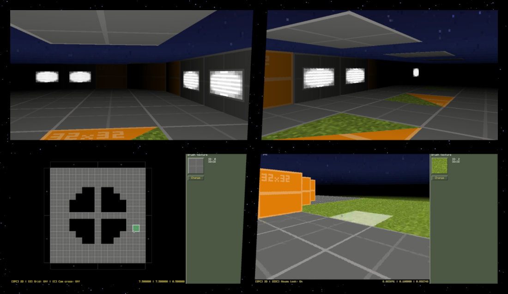
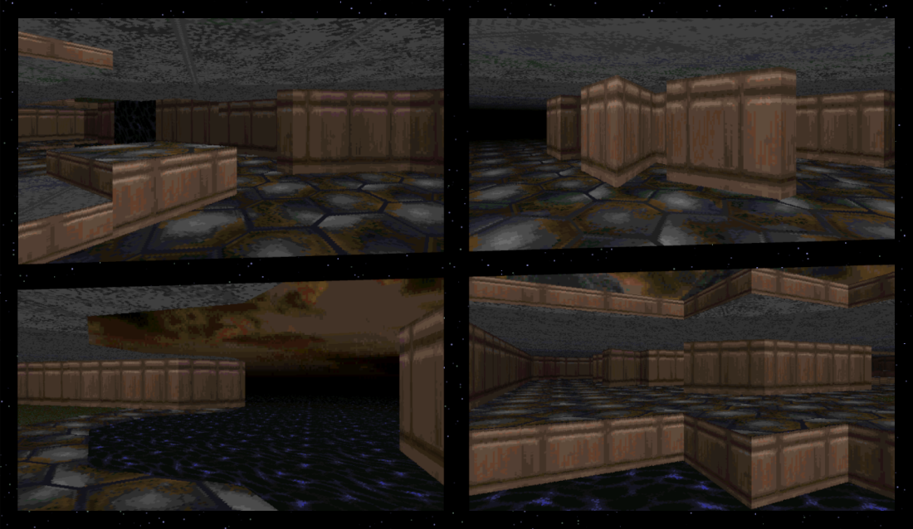
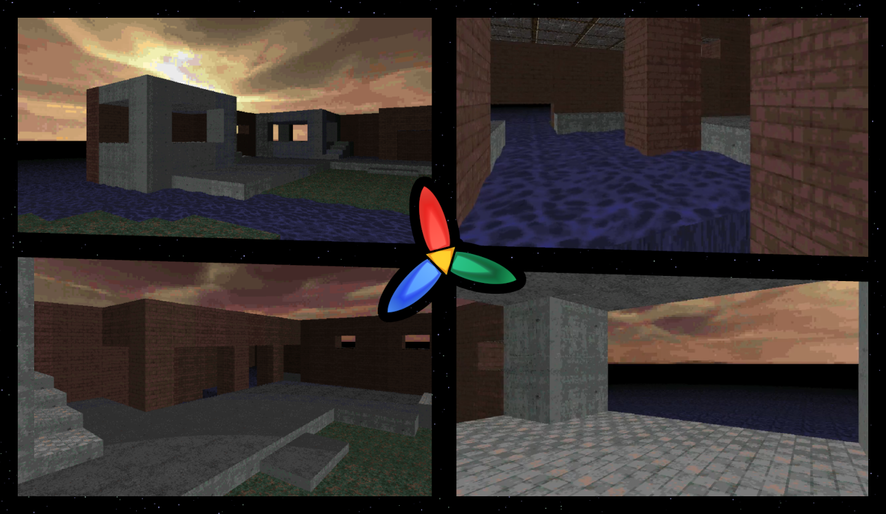

# Trinity History [WIP]

	
Table of contents

	<ul>
		<li><a href="#1st-version">1st Version</a></li>
		<li><a href="#2nd-version">2nd Version</a></li>
		<li><a href="#3rd-version">3rd Version</a></li>
		<li><a href="#4th-version">4th Version</a></li>
	</ul>

## 1st Version

	

 

The first ever version of Trinity. Trinity was not actually even called Trinity yet, the name
Trinity only started being used during the 3rd version. This version was mostly just a basic RGB
raycaster with a sky that had an almost correct "3D" perspective, some ice physics on ice floor, 2D
map view, skybox water floor and a wall texture camera display system. It was mostly just a
raycasting test, not yet intended to be an actual game engine, but it laid the ground for upcoming
versions. I even started developing a UI which I extended in the next version.

## 2nd Version

	

 

Probably the funnest version. This is the version where I decided I want this to be a game engine.
I made some basic Valve-inspired placeholder textures, added 45-degree angled walls, a lightmap
system for textures and made a [Hammer Editor](https://developer.valvesoftware.com/wiki/Valve_Hammer_Editor_(GoldSrc))/[Eureka Editor](https://doomwiki.org/wiki/Eureka)-inspired
map editor with UI that blatantly copied colors from the [GoldSrc](https://developer.valvesoftware.com/wiki/GoldSrc)
UI (they were placeholder colors though, of course).

## 3rd Version

	

 

This is the point when Trinity started being called Trinity. The engine probably got the most
advanced in this version. The mistake of the previous version was creating a map editor before the
engine even had all the features I wanted, so in this version I decided to first add those features;
proper angled walls (not just 45-degree), Doom-like ceiling/floor height, sprites, shadowmap and
more (however, only angled walls and height got implemented). I also implemented a procedural water
texture animation (described in the [README.md Last Unpublished Version section](./README.md#last-unpublished-version)).

## 4th Version

	

 

I made a logo for Trinity in this version. I wanted to keep it simple and retro-looking, and I was
quite satisfied with the result. The engine recieved minor improvements in this version, such as
proper "3D" sky perspective, rendering quality/speed improvements, and better texturing (textures no
longer got stretched vertically). I also added a cool "3D" water waves effect (described in the [README.md Last Unpublished Version section](./README.md#last-unpublished-version)).
However, this version had a small downgrade from the previous one - it had no angled walls. I never
got angled walls working properly with height in the previous version, so i scrapped them and never
got around to implementing them again.
